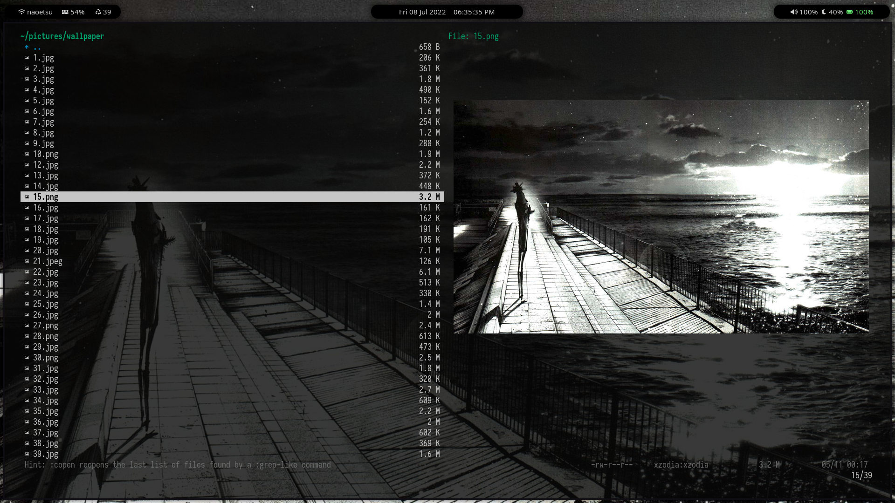

# dotfiles

The dotfiles for my Linux setup

- OS: [Arch Linux](https://www.archlinux.org)
- WM: [bspwm](https://github.com/baskerville/bspwm)
- Shell: [fish](https://fishshell.com)
- Status Bar: [Polybar](https://github.com/jaagr/polybar)
- Compositor: [Picom](https://github.com/yshui/picom)
- Terminal: [Alacritty](https://github.com/alacritty/alacritty) & [kitty](https://github.com/kovidgoyal/kitty)
- Text Editor: [Neovim](https://neovim.io)
- File Manager: [Vifm](https://vifm.info/)

## Screenshots

